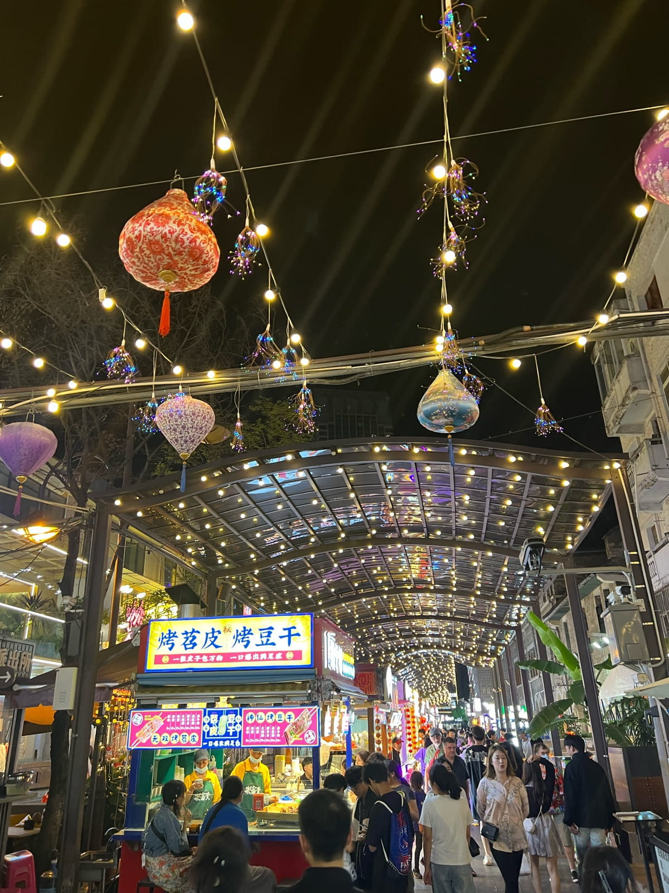
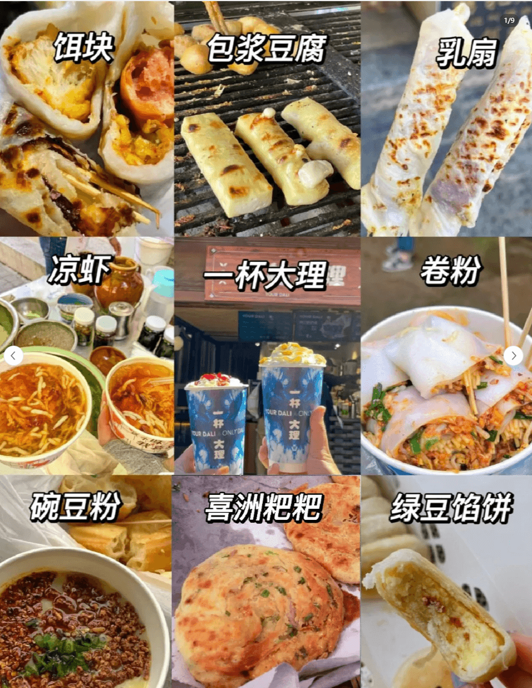
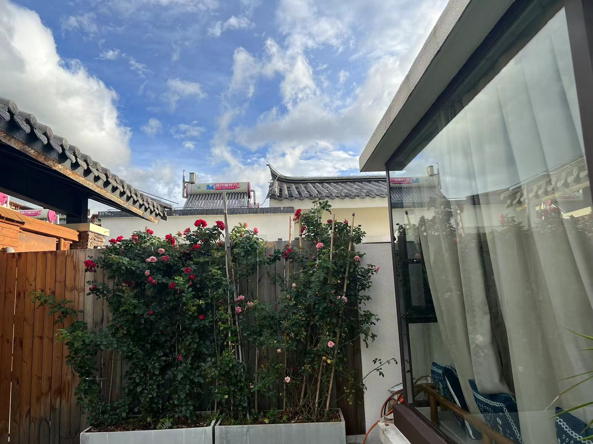
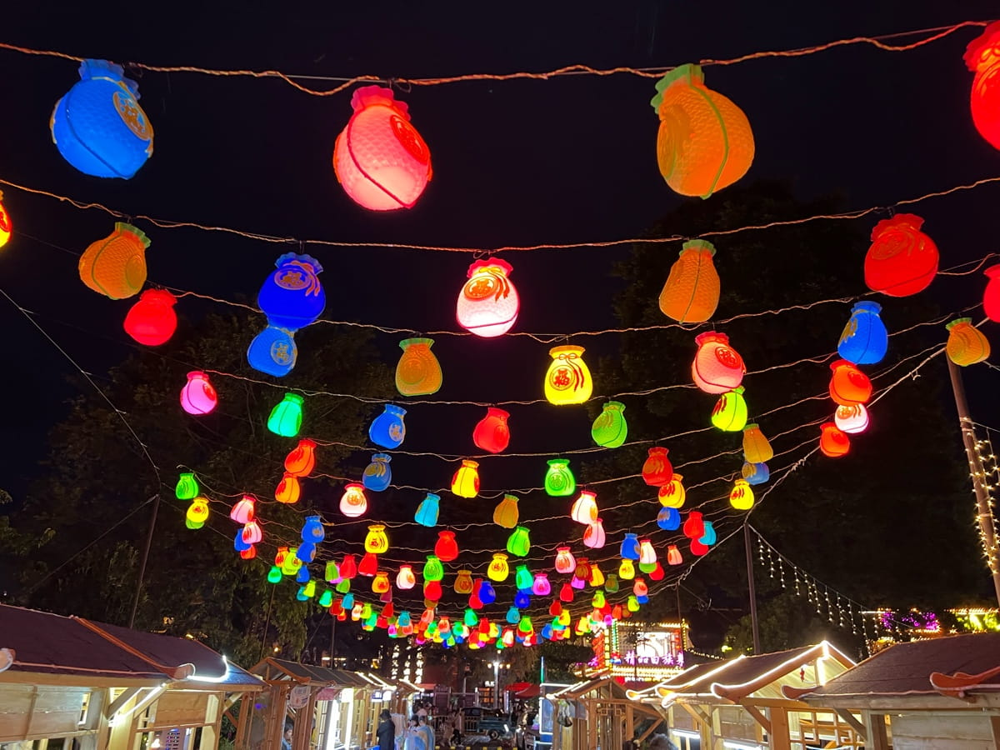
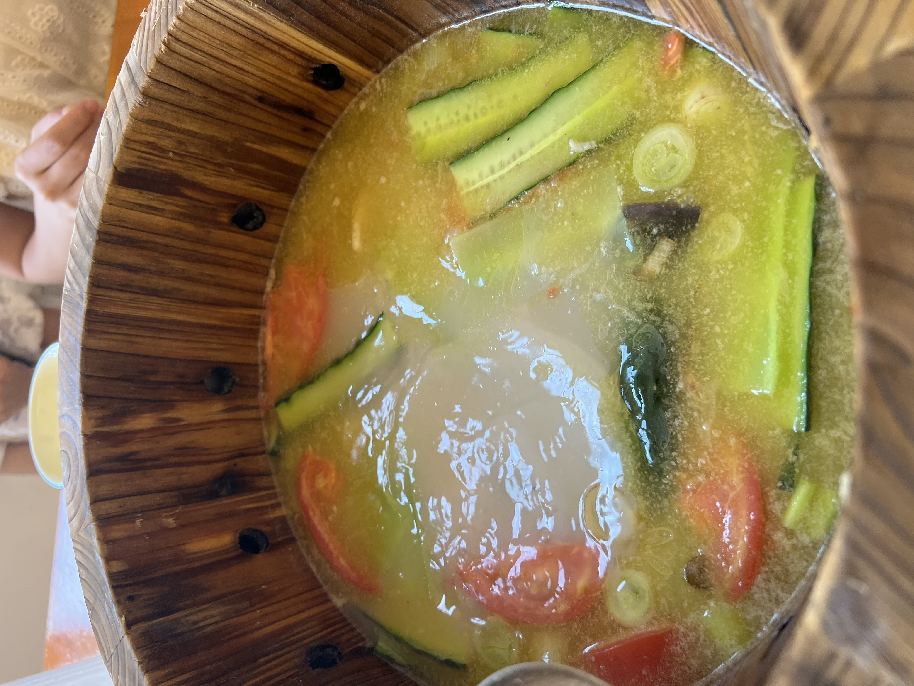
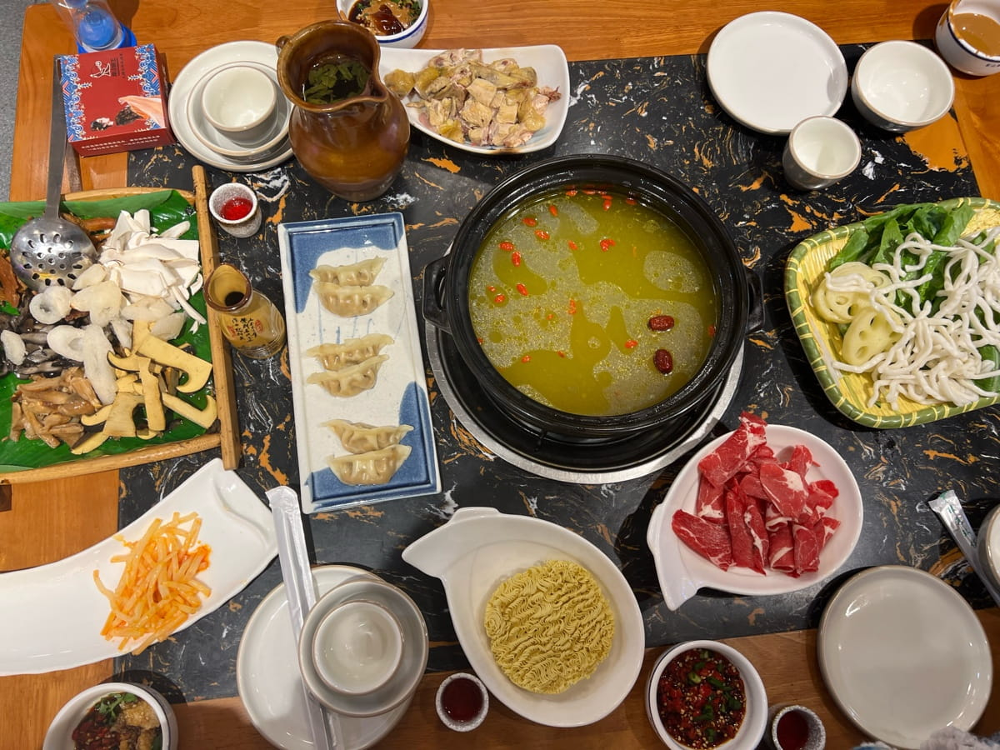
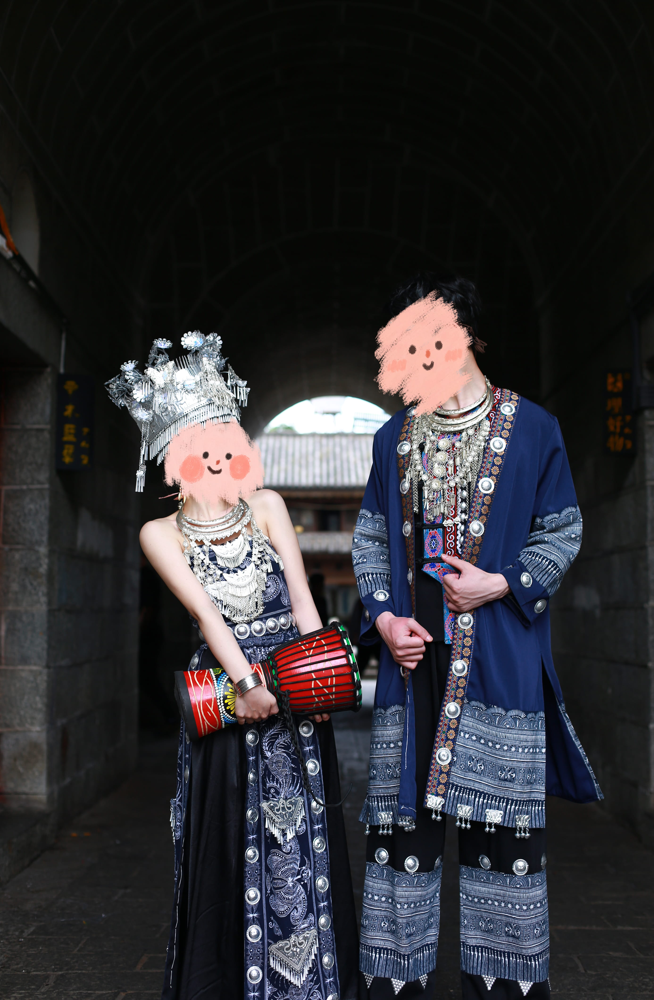
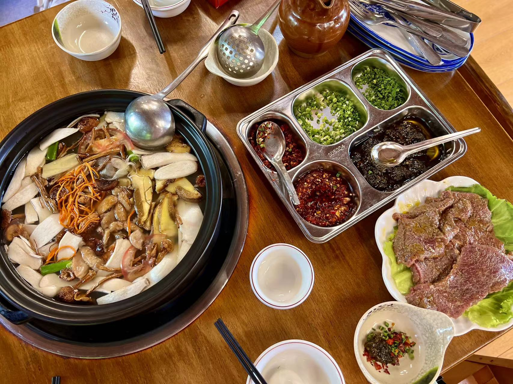

### 总结: 值得一去

优点:

1. 风景优美: 自带滤镜的天空大海,还有路途中间看到的一些风景,总能让人心旷神怡.

 2. 物价便宜: 扣去机票这个大头,我们三个大人加一个七岁孩子总花销在1w左右(包含七天住宿),我们租得是4人名宿,一晚平均400块.

3. 气候宜人: 虽然昼夜温差大,但是早晚多穿个外套基本就解决了.睡觉不需要开空调.不过好多民宿压根就没装空调.

缺点:

1. 紫外线强: 需要穿长袖戴帽子防晒,不然可能一下就被晒伤了

2. 非常干燥: 每天起床口干舌燥的,一天喝水量倍增.

3. 似乎没有什么特别好吃的美食(可能是我没找到)

4. 每个景点都相距挺远的,最好做好规划.给人感觉去云南更适合自己自驾游.

### 详情记录

#### 第一天

第一天从杭州坐飞机到达昆明,住在了南强步行街和昆明站的中心位置.主要为了方便晚上去南强步行街闲逛和第二天方便打车去动车站.

南强步行街,其实就是一条包含云南特色的现代商业化步行街,去不去都行.
在步行街吃了一碗菌菇米线.看起来非常大的一碗,但是配菜没想象得多,一个人应该能吃饱,两个人一起吃一碗就不够吃了.

米线味道还行,有些菌菇好吃有些不好吃总体还行.

价格99,有点小贵.

#### 第二天

早上7.30从昆明站出发前往大理站,到达大理站再打车到住宿的地方放完行李已经接近中午12点了.

我们住在古城外驾车需要十几分钟的地方.因为听说古城内酒店设施旧且费用高.所以没有选择住在古城内.

当天大理下着小雨,我们到达大理古城后打着伞步行.当天人流量挺多的.当天主要闲逛了一下古镇和吃了一些小吃.

小吃总结:

	基本都不好吃,推荐好几个人一起去的话买一份尝尝味道就行.不要每个人买一份浪费钱.
	
	注: 以下只是个人感受,可能某些店铺的食物会好吃一点.
	
	饵块:5元一个-外面裹着一层吃起来像年糕一样,里面是啥不知道.味道一般,但是也没有不好吃.
	
	爆浆豆腐: 忘记多少钱了,反正不太好吃.一点爆浆的口感都没有,酱料也没入味.
	
	乳扇:5元一个,不好吃.里面裹着鲜花瓣.吃不习惯,吃一口就感觉腻了.
	
	凉虾: 不知道怎么形容这东西,喝起来一点淡淡的味道,吃起来也没啥味道. 味道都一般.
	
	一杯大理:挺好喝的,感觉比一点点那些奶茶强.推荐喝一杯试试.
	
	卷粉:看起来像凉皮,吃起来口感完全不一样.但是也不属于好吃的类型.我买了没吃完.
	
	喜洲粑粑: 5元一个-吃起来非常非常干,不好吃,感觉都不如鄞州烧饼.
	
	豌豆粉和绿豆馅饼没吃不做评价,因为当时食物没拍图片.上面是我网上找到图,样子都差不多.

另外当天中午我想找一家叫感通一家人的店吃饭(之前查攻略看到有人推荐的),结果跟着地图到了地方发现附件竟然根本没这家店,最后只能选择附近的其他饭店.不清楚是不是高德地图的原因还是搬店了.

另外找的一家是云南特色菜的店,点了三道菜只有一道菌菇炒肉好吃.

下午回民宿住了一下,晚上又来大理古城逛了.大理的天黑的非常非常慢.晚上八点多才基本天黑.

下面是下午七点半我拍的天空.

晚上古镇会比白天热闹一些,氛围个人感觉也好一些.可以适当游玩一下.

#### 第三天

包车环洱海:,费用400,总时长九个小时.超出一小时50元.

师傅会根据你的需求随叫随停,你进景点会在景点门口附近等你.自己玩完这个景点发消息给师傅就行.

注:

	• 这是旺季价格,因为七月属于暑假了.淡季基本两三百.
	
	• 推荐先问一下民宿老板价格,然后扣50元基本就是行情价.比如我问民宿老板价格是450.
	
	• 平时打车的时候觉得坐着舒服没有烟味师傅态度也还行,就可以直接问问师傅包车环海多少钱,基本当地师傅都干这个.
	
	• 不太推荐租车,应该损坏了就很麻烦.而且每个景点停车挺麻烦的.

这个景点分布图是我找的网图,侵删.

今日总结: 风景还行,值得看看. 但是给司机差评.带我们下车的地方都感觉挺奇怪的.

当天景点总结:

- S湾: 当天的第一个景点,所以感觉挺满意的能看到大海,风景也还行.后来自己去了龙龛(kān)码头发现那边风景更好.这两个地方去一个就行了.推荐让师傅去龙龛码头.

-  喜洲古镇: 我们走了到网红转角楼然后就返回了,转角楼没啥好看的.在古镇里面的感觉不如大理古镇.不过除了步行还有做电车游玩的方式,我们没坐所以不做评价.

	P: 没怎么玩的原因是师傅在非常远的地方放我们下车,害我们白走了很多冤枉路后发现里面有个停车场.这时候才发现师傅似乎不太熟练.不过也没啥办法.

- 双廊古镇: 这个景点有两个入口, 最好让师傅放你在离海近的路口.没走多远就能看到海了.在海岸边不远处有个小岛可以坐船过去,不过要收费.我们没上小岛.简单在附近拍了一些照片就回去了.另外在这个景点的路上我们还买了竹筒饭和脆皮五花肉.味道还挺不错的,推荐.

- 小普陀: 非常小的一个小岛,我们没上去.不过远看风景其实和之前在双廊古镇看到的差不多.感觉没啥必要停留再此. 我们在附近吃了一个木桶鱼,味道还行,但是分量挺少的,感觉性价比不高.
- 木桶底下全是鹅卵石,另外蘸料算钱也没提前和我们说. 一个三斤鱼套餐总共花了268.
- 

- 理想邦: 就是一堆白色建筑,远看还行.走进去一看感觉没啥值得一看的地方.

- 兴盛大桥: 就是一条让车通行的桥..不懂为啥也算一个景点. 听说晚上风景好看?但是等到大理天黑你包车时间早结束了.

晚上我们休息了一下,去古城门外的一家菌菇火锅店吃了一顿.这一顿物超所值.

三个人点了一个2-3人套餐花费168,吃饱了而且还挺好吃的.

#### 第四天

今日陪家人旅拍, 找了一家店一人298,精修六张大概有30张底片全送.

- 女生大概一小时化完妆,男生大概半小时.

- 服装自选,有挺多民族的特色服装可以选择的.

- 跟着摄影师在拍照大概1-2小时之后,可以自己穿着服装去任何地方拍照.晚上来还就行.我们后来去了龙龛码头

- 摄影师的水平不太行,拍出来的照片还不如我苹果相机直出的好.

龙龛码头:

- 汽车不能直接到达岸边, 需要走路或者坐电车进去.

- 坐电车记得砍价,我们三个人本来15,讲一下价格10块就可以了.

- 码头挺适合骑自行车吹吹海风

另外一件趣事就是晚上我们在古镇里买衣服,在一家店跟老板砍完价之后,路过另一家店门口看见一模一样的衣服比我们刚刚砍完价之后还低. 古镇里的衣服基本砍个七折肯定是没问题的.

#### 第五天

苍山

总结:体验不好,因为我们计划直达山顶,结果只有半程索道.山顶没去着,饭没吃着, 还走了很多冤枉路.

- 总共有三条索道,我们体验的是洗马潭.

- 洗马潭半程门票 195/人,全程门票320/人. 1.2米以下小孩免费.

- 洗马潭门票包括天龙八部影视城和地址公园的门票.并且和另外两个索道通用.

- 网上订票的时候说是8:30开始售票,实则需要到9点才能判断当天索道能不能运行.

- 当天我8.30到达排队,工作人员都在闲聊.没有看到通知要等半小时后才能知道今天能不能开放索道.

- 当天直到9.10窗口才开始售票,并且因为当天风大所以只能卖半程票.原先买的全程票自己退.

- 没有电子取票机器.

这个景点分布图是我找的网图,侵删.

路线总结:

1. 我们从洗马潭索道做到半山腰,因为天气原因只能坐到这.

2. 往下走了1111阶梯到达了七龙女池,说实话没啥好看的,就几个小瀑布池子.非要走得话走到四五龙池就行了,后面两个更难看.

3. 从七龙女池走到感通索道,路上风景还行就是实在太远了. 我们走了快两小时才到.对于我们这些长年宅没运动的人来说太煎熬了.

4. 清碧池就是一个写平安符挂在上面的小地方,池水是挺清的.

5. 而后我们就坐感通索道下前往寂照庵,去寂照庵都是上坡.走起来也非常得煎熬,我们当时已经精疲力尽.走到寂照庵就为了想吃一口斋饭,听别人说那儿的斋饭好吃.结果到达已经下午2.30分了,斋饭时间已经结束了. 我便买了一包奥利奥吃, 这时才意识到,好吃的其实不是斋饭.而是精疲力尽饿坏肚子的人吃啥都是美味o(╥﹏╥)o.

第六天

沙溪古镇: 风景不错,人也不算多. 和大理古镇完全不一样的感受. 小镇内基本都是古色古香的老建筑.小镇外的河水十分清澈.总的来说值得一去,就是来回的车费和时间有点多.

- 大理古镇出发到沙溪古镇路程大概两个半小时.

- 包车来回费用600元,如果走高速单程高速费接近100块.来回都走高速相当于+200块. 推荐去的时候让师傅走山路看看路上风景,回来的时候走高速.

- 小镇口摆摊的煮玉米意外的好吃,一根五块我们吃了六根.

- 骑马费用挺便宜的, 骑马10分钟30元,还会帮你拍照.

- 小镇附近有因为刘亦菲那部剧火的网红景点,先锋书局和半山咖啡个人觉得实在没必要去. 一点小小的地方风景也不太好看. 为了打卡而打卡,浪费时间.

- 在当地吃了菌菇牛肉火锅,店里环境给人挺好的,就是吃起来味道一般般.

- 从沙溪回来我们让师傅送我们到了大理站附近,第二天就坐车到昆明飞回家了.

### 最后

总结仅为个人游玩感受,每个人在不同的时间不同的路线肯定会有不同的感觉.以上总结仅供参考.希望大家都有一个值得回忆的旅途.